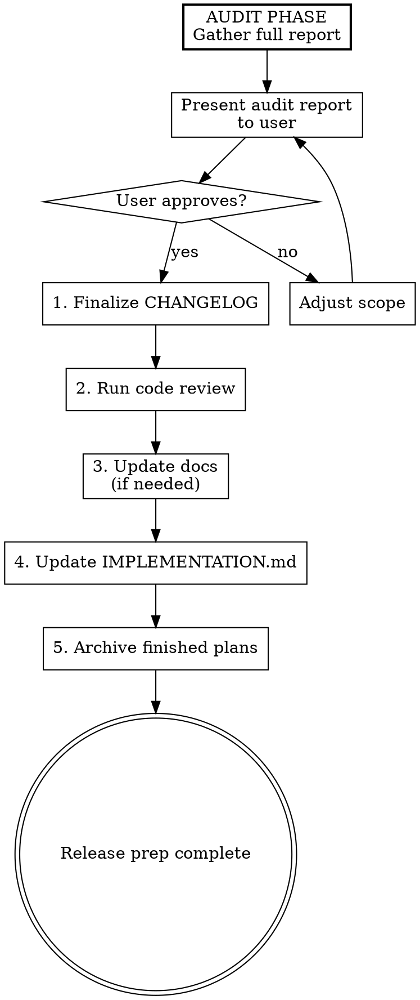

# Preparing a Release

## Overview

Audit and prepare the codebase for a new release. Produces a full report first, then executes approved changes sequentially with checkpoints.

## When to Use

- Before creating a release tag
- When the user says "prep release", "prepare release", or "get ready for release"
- When CHANGELOG needs finalizing for a version bump

## Process



## Audit Phase

Gather all information into a single report before changing anything.

### 1. CHANGELOG Audit

- Find the latest git tag: `git describe --tags --abbrev=0`
- Compare `git log <last-tag>..HEAD --oneline` against `CHANGELOG.md [Unreleased]` section
- Flag commits that have no corresponding CHANGELOG entry
- Flag CHANGELOG entries that don't match any commit

### 2. Plans Audit

- List all files in `plans/` (excluding `plans/archive/` and `plans/IMPLEMENTATION.md`)
- For each plan file, check if the work described is complete (merged, tests passing)
- Flag completed plans that should move to `plans/archive/`

### 3. Implementation Tracker Audit

- Read `plans/IMPLEMENTATION.md`
- Cross-reference completed work (from git log) against unchecked items
- Flag tasks that are done but not checked off

### 4. Docs Audit

- Invoke `noor:update-docs` analysis step (Analyze + Propose only, no execution)
- Include any doc gaps in the report

### Report Format

```
## Release Audit Report

### CHANGELOG
- 3 commits missing from [Unreleased]: <list>
- 1 stale entry (no matching commit): <entry>

### Plans to Archive
- plans/encryption-design.md (merged in v0.6.0)

### IMPLEMENTATION.md Updates
- [ ] "AES-256-GCM encryption" — done, needs checking off

### Docs Gaps
- docs/reference/logs.md needs update for new --follow flag

### Summary
- 4 items to address before release
```

## Execute Phase

After user approves the report, execute each step with a checkpoint:

### 1. Finalize CHANGELOG

- Add missing entries to `[Unreleased]` section following Keep a Changelog format
- Rename `[Unreleased]` to `[<version>] - <today's date>`
- Add a new empty `[Unreleased]` section above
- Ask user to confirm the version number before writing
- Show diff, confirm before proceeding

### 2. Run Code Review

- Invoke `superpowers:requesting-code-review` skill
- If review surfaces issues, pause and let user decide whether to fix now or proceed

### 3. Update Docs

- If the audit found doc gaps, invoke `noor:update-docs` execute step
- If no gaps were found, skip with confirmation

### 4. Update IMPLEMENTATION.md

- Check off completed tasks identified in the audit
- Log commit hashes in `plans/archive/ARCHIVED-IMPLEMENTATION.md`
- Show diff, confirm before proceeding

### 5. Archive Finished Plans

- Move each completed plan from `plans/` to `plans/archive/`
- Show which files were moved, confirm before proceeding

## Key Rules

- **Never skip the audit** — always produce the full report before executing anything.
- **Checkpoint after every step** — don't batch execute without confirmation.
- **Version number comes from the user** — never guess the next version. Ask.
- **CHANGELOG format** — follow [Keep a Changelog](https://keepachangelog.com/en/1.1.0/) with categories: Added, Changed, Fixed, Removed.
- **Don't create the git tag** — that's handled by the existing release script. This skill prepares the content only.
