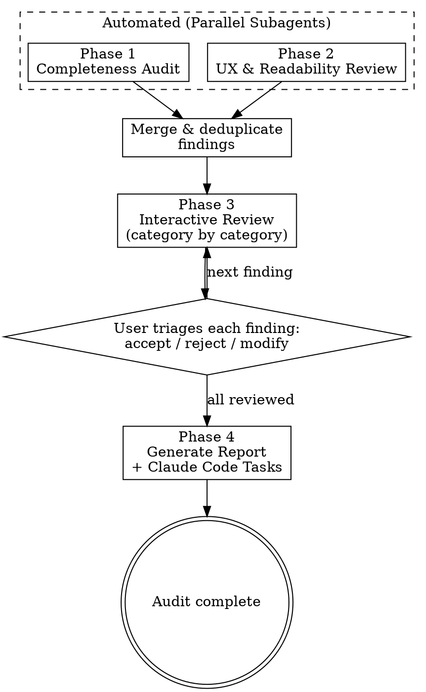

# Documentation Audit

## Overview

Comprehensive documentation audit that validates completeness against the codebase (source code, CHANGELOG, and CLAUDE.md) and reviews UX quality (structure, formatting, discoverability). Runs automated analysis first, then presents findings interactively for triage, and produces a curated markdown report with a task list.

## When to Use

- Before a release (invoked by `skybox-prep-release`)
- When the user says "audit docs", "check docs", "review documentation"
- When `skybox-update-docs` detects more than 3 pages needing updates and suggests a full audit
- When the user asks about documentation completeness, quality, or improvements

## Process



## Phase 1: Completeness Audit

Run as a subagent. Cross-reference three sources to find gaps, staleness, and drift.

### 1.1 Source Code vs Docs

**Commands:**
- Read every file in `src/commands/` — extract command name, arguments, options, and flags from the Commander.js definitions
- For each command, verify a matching page exists in `docs/reference/` with all arguments and options documented
- Cross-check against `docs/.vitepress/commands.ts` (the single source of truth for sidebar) — flag any command missing from the sidebar or sidebar entries with no matching doc page

**Config:**
- Read `src/types/index.ts` — extract all config-related interfaces and their fields
- Verify `docs/reference/configuration.md` documents every field
- Read `src/lib/constants.ts` — extract environment variables, default values, and template definitions
- Verify docs reflect current values (not outdated defaults)

**Templates:**
- Read `TEMPLATES` constant in `src/lib/constants.ts` — verify `docs/reference/custom-templates.md` lists all built-in templates and their fields match

### 1.2 CHANGELOG vs Docs

- Read `CHANGELOG.md` — identify all entries since the last git tag (`git describe --tags --abbrev=0`, or root commit if no tags)
- For each Added/Changed/Fixed entry, check if the corresponding docs page was updated (search for relevant keywords in docs files)
- Flag entries with no apparent docs coverage

### 1.3 CLAUDE.md vs Docs vs Source

- Compare CLAUDE.md "Key Files Reference" table against actual files in `src/` — flag missing or stale entries
- Compare CLAUDE.md "Environment Variables" table against `docs/reference/configuration.md` env vars section and `src/lib/constants.ts` — flag inconsistencies
- Check if CLAUDE.md "Known Gotchas" that affect users are surfaced in `docs/guide/troubleshooting.md` where relevant

### 1.4 Severity Classification

Each finding gets a severity:
- **missing** — not documented at all (feature, option, or config exists in code but not in docs)
- **stale** — documented but outdated (values, behavior, or structure changed)
- **drift** — inconsistent between sources (docs says one thing, CLAUDE.md says another, code does a third)

## Phase 2: UX & Readability Review

Run as a separate subagent in parallel with Phase 1. Analyze docs from a user's perspective.

### 2.1 Structure & Flow

- Map the learning journey: homepage → installation → quick start → concepts → workflows → reference
- For each page, check it has clear "next step" guidance — flag dead ends (pages with no links to what to read next)
- Check the guide section progresses simple → advanced without assuming knowledge not yet introduced
- Verify the sidebar order matches the recommended reading order

### 2.2 Scannability & Formatting

- Flag pages over ~500 lines as candidates for splitting
- Check heading hierarchy is consistent (no skipped levels like h2 → h4)
- Verify all command reference pages follow the same structural template (usage, arguments, options, description, examples, exit codes, see also)
- Look for walls of text (>10 consecutive lines of prose without a heading, table, code block, or callout)
- Verify code examples have language tags for syntax highlighting
- Check tables are used effectively for structured data (options, flags, env vars)

### 2.3 Cross-linking & Discoverability

- For each page, check that mentions of other SkyBox concepts link to their dedicated pages (e.g., "sync" in a guide page should link to the sync section in concepts)
- Check for orphan pages — pages not linked from any other page or sidebar
- Verify "See Also" sections on command pages reference relevant sibling commands
- Check that troubleshooting entries link back to the feature docs they relate to
- Verify the homepage hero actions link to the right starting points

### 2.4 Impact Classification

Each finding gets an impact rating:
- **high** — users will get lost or confused (missing navigation, wrong reading order, dead ends)
- **medium** — suboptimal but navigable (inconsistent formatting, long pages, missing cross-links)
- **low** — polish (minor formatting, extra cross-links that would be nice to have)

## Phase 3: Interactive Review

After both automated phases complete, present findings to the user one category at a time.

### Presentation Order

1. **Completeness: Missing** — features/options with no docs (highest priority)
2. **Completeness: Stale/Drift** — docs that exist but are outdated or inconsistent
3. **UX: High impact** — structure/flow issues that confuse users
4. **UX: Medium impact** — formatting and discoverability improvements
5. **UX: Low impact** — polish items

### For Each Category

- Present a summary: count of findings and brief list
- Show each finding with:
  - What's wrong (specific file and line/section reference)
  - Why it matters
  - Suggested fix (concrete and actionable)
- Ask the user to triage using `AskUserQuestion`:
  - **Accept** — include in final report as-is
  - **Modify** — edit the suggestion before including
  - **Reject** — skip this finding
  - **Accept all remaining in this category** — speed through low-priority items

### Running Progress

Show progress after each decision:
```
[8/23 findings reviewed — 6 accepted, 1 modified, 1 rejected]
```

## Phase 4: Report Generation

After all findings are triaged, generate the final report.

### Output File

Write to `.context/docs-audit-YYYY-MM-DD.md`. Create `.context/` if it doesn't exist. Overwrite if a report for today already exists.

### Report Structure

```markdown
# SkyBox Documentation Audit — YYYY-MM-DD

## Summary

- **Findings accepted:** X (Y completeness, Z UX)
- **Severity breakdown:** N missing, N stale, N drift, N high-UX, N medium-UX, N low-UX
- **Effort estimate:** N quick wins, N moderate, N substantial

## Completeness Findings

### Missing Documentation

- **[finding title]** — `src/path/file.ts` defines `--flag` but `docs/reference/command.md` does not document it
  - **Fix:** Add `--flag` to the Options table in `docs/reference/command.md`
  - **Effort:** Quick win

### Stale / Drifted Documentation

- **[finding title]** — `docs/reference/configuration.md` says default is X, but `src/lib/constants.ts` defines Y
  - **Fix:** Update the default value in `docs/reference/configuration.md`
  - **Effort:** Quick win

## UX Findings

### Structure & Flow

- **[finding title]** — `docs/guide/concepts.md` references encryption before `docs/guide/installation.md` introduces it
  - **Fix:** Add a forward-link or reorder sections
  - **Effort:** Moderate

### Scannability & Formatting

- ...

### Cross-linking & Discoverability

- ...

## Task List

Ordered by priority (high → low), grouped by effort.

### Quick Wins

- [ ] [description] — `docs/path/to/file.md`
- [ ] [description] — `docs/path/to/file.md`

### Moderate Effort

- [ ] [description] — `docs/path/to/file.md`, `docs/other/file.md`

### Substantial

- [ ] [description] — multiple files, may need new page
```

### Claude Code Task Creation

After writing the report, create Claude Code tasks via `TaskCreate` for each accepted finding so they're immediately trackable. Group related findings into single tasks where it makes sense (e.g., "Update all missing options for the `up` command" rather than one task per option).

## Integration with Other Skills

### Called by `skybox-prep-release`

When invoked as part of release prep:
- Run Phases 1-3 as normal (interactive triage)
- If any **missing** severity findings are accepted, warn that docs should be updated before tagging
- **Stale/drift** and UX findings don't block the release but are included in the report
- The release prep skill references the generated report in its own audit output

### Suggested by `skybox-update-docs`

When `skybox-update-docs` detects more than 3 pages needing updates during its analysis step, it should suggest:
```
This looks like it needs a broader audit. Consider running `skybox-audit-docs` for a comprehensive review.
```

## Key Rules

- **Parallel subagents** — Phase 1 and Phase 2 MUST run as parallel subagents via the Task tool for speed. Launch both in a single message but do NOT use `run_in_background: true` — wait for both to complete before proceeding
- **Never skip interactive triage** — always present findings for user review before generating the report
- **Concrete suggestions only** — every finding must include a specific, actionable fix with file paths
- **No false positives** — if unsure whether something is a gap, verify by reading both the source code and the docs before flagging
- **Preserve existing quality** — the docs are already well-structured; focus on gaps and improvements, not rewriting what works
- **Report is ephemeral** — `.context/` is gitignored; the report is working state, not a permanent artifact
- **Read fresh every time** — do not assume docs or source content; always read files at the start of each run
