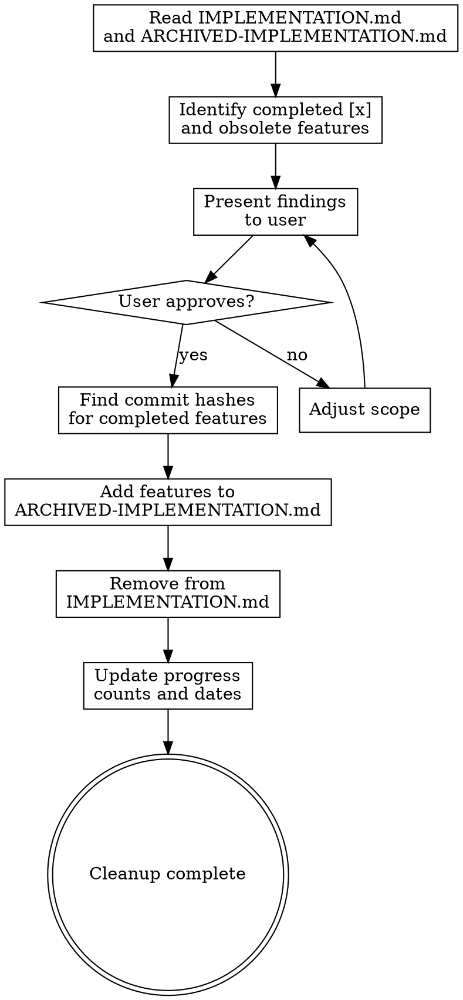

# Implementation Tracker Cleanup

## Overview

Clean up `plans/IMPLEMENTATION.md` by archiving completed features, removing obsolete items, and updating progress counts. Ensures the tracker reflects current state.

## When to Use

- After a release when features are marked complete
- When removing features that are no longer viable
- When the user says "clean up implementation", "archive completed features", or "update the tracker"

## Process



## Audit Phase

### 1. Read Both Files

- Read `plans/IMPLEMENTATION.md` for current state
- Read `plans/archive/ARCHIVED-IMPLEMENTATION.md` for archive format

### 2. Identify Completed Features

- Find all items marked `[x]` in the Future Features sections
- These need to move to the archive

### 3. Identify Obsolete Features

- Ask user if any `[ ]` items should be removed (not viable, out of scope, etc.)
- These are deleted, not archived

### 4. Present Findings

```
## Implementation Cleanup Report

### Completed Features to Archive
- Status Dashboard (TUI) — High Priority
- Hooks System — High Priority

### Obsolete Features to Remove
- Cloud Storage Backend — Exploratory (user requested removal)

### Current Counts
- Before: 6/21 future features completed
- After: 0/17 future features remaining
```

## Execute Phase

### 1. Find Commit Hashes

For each completed feature, search git log for the implementation commit:

```bash
git log --oneline main -100 | grep -iE "feature|keyword"
```

Look for feat: commits that match the feature name.

### 2. Update Archive

Add a new version section to `plans/archive/ARCHIVED-IMPLEMENTATION.md`:

```markdown
## v0.X.X Features

- [x] **Feature Name** — Brief description — `commit_hash`
```

Update the `*Archived:` date at the bottom.

### 3. Update IMPLEMENTATION.md

- Remove completed `[x]` features from their sections
- Remove obsolete features entirely
- Keep section headers even if empty (unless all items removed)

### 4. Update Counts and Dates

Recalculate the progress line:

```markdown
> **Progress:** X/Y future features | A/B checklist items | C/D release tasks
```

Count remaining `[ ]` items in each category:
- Future features: High + Medium + Lower + Exploratory
- Checklist items: Pre-Production Checklist section
- Release tasks: Release Preparation section

Update `*Last updated:` date.

## Key Rules

- **Audit first** — always show report before making changes
- **Archive, don't delete** — completed features go to archive with commit refs
- **User confirms removals** — obsolete features require explicit user approval
- **Preserve format** — maintain existing markdown structure and conventions
- **Accurate counts** — manually verify counts after editing
