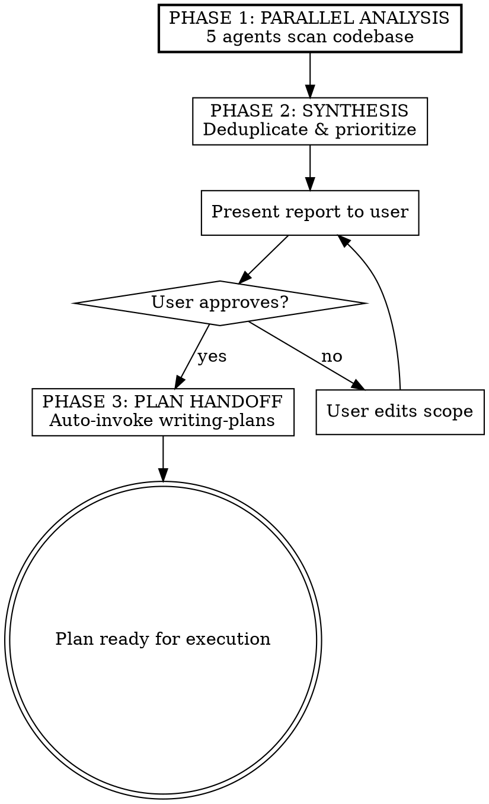

# Simplify Source Code

## Overview

Audit the entire codebase for simplification opportunities using parallel code-simplifier agents. Produces a prioritized report, then chains into writing-plans to create an actionable implementation plan.

## When to Use

- Periodic codebase health check
- Before a major refactor
- When the codebase feels cluttered or inconsistent
- When you suspect duplicate logic across files

## Process



## Phase 1: Parallel Analysis

Dispatch 5 code-simplifier agents in parallel using the Task tool with `subagent_type: "code-simplifier:code-simplifier"`.

**Agent assignments:**

| Agent | Scope | Rationale |
|-------|-------|-----------|
| A | `src/lib/` | Shared libraries — highest redundancy surface |
| B | `src/commands/` | Command implementations — pattern consistency |
| C | `src/types/` + `src/index.ts` | Types & entry point — dead exports, naming |
| D | `tests/unit/` | Unit tests — test utility extraction, consistency |
| E | `tests/integration/` + `tests/e2e/` + `tests/helpers/` | Other test tiers — shared helper patterns |

**Each agent receives this prompt:**

```
You are analyzing {directory} in the SkyBox codebase for simplification opportunities.

FIRST: Read CLAUDE.md at the project root for project conventions and known gotchas.

Then scan every file in {directory} for issues in these 7 categories:

1. **Redundant code** — duplicate logic across files that could be consolidated
2. **Reusable component extraction** — repeated patterns that should become shared utilities
3. **Dead code** — unused exports, unreachable branches, stale imports
4. **Unnecessary complexity** — over-nested logic, overly clever patterns that could be flattened
5. **Naming inconsistencies** — similar concepts named differently across files
6. **Error handling patterns** — inconsistent use of getErrorMessage()/getExecaErrorMessage() from src/lib/errors.ts
7. **Import path consistency** — relative imports (../, ./) that should use aliases (@lib/*, @commands/*, @typedefs/*, @tests/*)

For each finding, provide:
- **Priority:** HIGH / MEDIUM / LOW
- **Files:** exact paths with line numbers
- **Issue:** 1-2 sentences describing the problem
- **Suggestion:** 1-2 sentences describing the approach to fix it

Priority levels:
- HIGH: real duplication or complexity that affects maintainability
- MEDIUM: inconsistencies worth fixing but not urgent
- LOW: minor style/naming nits

IMPORTANT RULES:
- Do NOT suggest code changes or write diffs. Analysis only.
- Do NOT modify any files.
- Respect documented gotchas in CLAUDE.md (e.g., private functions that can't be imported are intentional).
- Do NOT flag patterns that are documented as intentional in CLAUDE.md.
- Output findings grouped by category.
```

## Phase 2: Synthesis & Report

After all agents complete:

1. **Collect** all findings from the 5 agents
2. **Deduplicate** — if multiple agents flag the same cross-cutting issue, merge into one finding
3. **Group** by category
4. **Sort** by priority within each category (HIGH first)
5. **Present** the report to the user interactively
6. **Save** to `.context/simplify-report-YYYY-MM-DD.md`

### Report Format

```markdown
## Simplification Report — YYYY-MM-DD

### Summary
- **Total findings:** N
- **High priority:** N
- **Medium priority:** N
- **Low priority:** N

---

### Category: Redundant Code

#### [HIGH] Brief title describing the issue
- **Files:** `src/lib/foo.ts:45-62`, `src/lib/bar.ts:88-103`
- **Issue:** Description of what is redundant
- **Suggestion:** How to consolidate

#### [MED] Brief title
- **Files:** `src/commands/up.ts:34`, `src/commands/down.ts:22`
- **Issue:** Description
- **Suggestion:** Approach

---

### Category: Import Path Consistency

#### [LOW] Brief title
- **Files:** `src/commands/clone.ts:3`
- **Issue:** Uses relative import instead of alias
- **Suggestion:** Replace with @lib/config.ts
```

## Phase 3: Plan Handoff

When the user approves the report (says "looks good", "approve", "yes", etc.):

1. Announce: "Invoking writing-plans skill to create an implementation plan from the approved findings."
2. **REQUIRED SUB-SKILL:** Invoke `superpowers:writing-plans` with the saved report as input requirements
3. The writing-plans skill produces a full task-by-task implementation plan with TDD steps

If the user wants to adjust scope before planning:
- Let them remove or reprioritize findings
- Update the saved report
- Then proceed with writing-plans on the revised report

## Key Rules

- **Read-only in Phase 1 & 2** — agents must never edit files. Analysis only.
- **CLAUDE.md awareness** — agents read CLAUDE.md first so they flag deviations from project conventions, not generic style preferences.
- **No false positives on intentional patterns** — respect documented gotchas and known limitations.
- **Deduplication is mandatory** — cross-cutting findings must be merged in synthesis, not listed twice.
- **Save before presenting** — always save the report to `.context/` before showing it to the user, so it survives context compression.
- **Auto-chain on approval** — don't ask "should I create a plan?" — invoke writing-plans automatically when the user approves.
