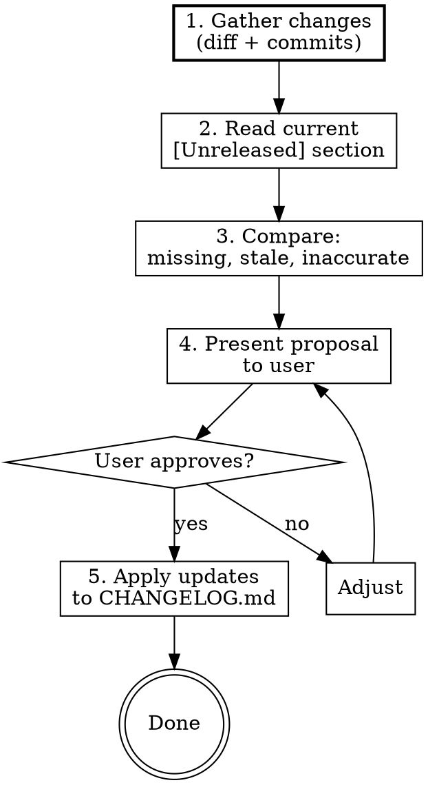

# Updating the Changelog

## Overview

Analyze recent commits and workspace diff against the current `CHANGELOG.md [Unreleased]` section, identify gaps, and propose updates.

## When to Use

- After finishing a feature, bugfix, or refactor
- When the user says "update changelog", "check changelog", or "sync changelog"
- When another skill (like `skybox-prep-release`) needs a changelog check
- Before merging a branch

## Process



### Step 1: Gather Changes

1. Find the base branch: `git merge-base main HEAD` (or fall back to last tag via `git describe --tags --abbrev=0`)
2. Get commit log: `git log <base>..HEAD --oneline`
3. Get full diff stat: `git diff <base>..HEAD --stat`
4. For each changed `src/` file, read the diff to understand what actually changed (not just file names)
5. Also check for changes to `docs/`, `tests/`, config files, and `package.json`

### Step 2: Read Current Changelog

1. Read `CHANGELOG.md` and extract the `[Unreleased]` section
2. Parse existing entries by category (Added, Changed, Fixed, Removed)

### Step 3: Compare and Identify Gaps

For each commit/change, determine:

- **Missing entries** — changes with no corresponding changelog entry
- **Stale entries** — changelog entries that don't match any current commit (reverted or changed scope)
- **Inaccurate entries** — entries that describe something differently than what was actually implemented
- **Category mismatches** — entries in the wrong category (e.g., a bug fix listed under Added)

Classify each change:
- **User-facing** — must be in changelog (new features, behavior changes, bug fixes, removals)
- **Developer-facing** — include if significant (type changes, API changes, refactors that affect extension points)
- **Internal-only** — skip (test-only changes, CI tweaks, plan archiving, skill edits, CLAUDE.md updates)

### Step 4: Present Proposal

Format the proposal clearly:

```
## Changelog Update Proposal

### Missing Entries (to add)
- **Added**: `escapeRemotePath()` for tilde-preserving shell escaping
- **Fixed**: SSH option injection — added `--` separator in SSH calls

### Stale Entries (to remove or revise)
- "Fixed: XYZ" — this was reverted in commit abc123

### Suggested Revisions
- "Security Hardening" entry — expand to mention fingerprint pinning

### No Changelog Needed
- Refactored test helpers (internal)
- Updated CLAUDE.md (internal)
```

Ask the user to approve, adjust, or skip.

### Step 5: Apply Updates

1. Edit `CHANGELOG.md` using the Edit tool
2. Follow [Keep a Changelog](https://keepachangelog.com/en/1.1.0/) format
3. Use categories: **Added**, **Changed**, **Fixed**, **Removed** (in that order)
4. Show the final diff to the user for confirmation

## Entry Writing Guidelines

- Start each entry with a dash and bold label for features: `- **Feature Name**: Description`
- Start plain entries with a dash and lowercase: `- Fixed thing that was broken`
- Use em-dash (`—`) for inline explanations: `- SSH injection — added separator`
- Keep entries concise but specific enough to be useful in release notes
- Group related changes into a single entry when they form a cohesive feature
- Don't include commit hashes in entries — the changelog is for users, not developers

## Key Rules

- **Always diff-driven** — never guess what changed. Read the actual diff.
- **Propose before editing** — never modify CHANGELOG.md without showing the plan first.
- **User-facing focus** — internal refactors and test changes don't go in the changelog unless they affect the public API or behavior.
- **Match existing style** — read the current changelog entries to match tone and formatting.
- **Don't touch version headers** — only modify the `[Unreleased]` section. Version stamping is handled by `skybox-prep-release`.
- **When called as a sub-step** by another skill, return the proposal only. Let the calling skill decide whether to execute.
