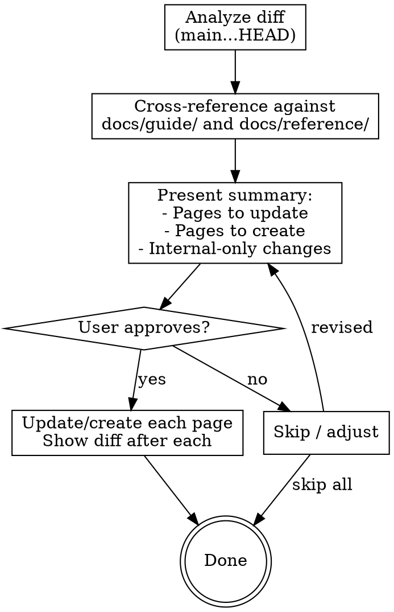

# Updating User Documentation

## Overview

Review recent work and determine which VitePress docs pages need creating or updating. Presents a proposal before making changes.

## When to Use

- After completing a feature branch before merge
- When `finishing-a-development-branch` or `prep-release` needs a docs check
- When the user explicitly asks to update docs

## Process



### Step 1: Analyze

1. Run `git diff main...HEAD --stat` and `git log main..HEAD --oneline` to identify all changes
2. Categorize changes:
   - **New commands** — needs a new `docs/reference/<command>.md` page
   - **Modified command behavior** — needs update to existing reference page
   - **New config options** — needs update to `docs/reference/configuration.md`
   - **New user-facing features** — may need guide page or section
   - **Internal refactors / test-only changes** — no docs needed
3. For each doc-worthy change, identify the specific docs file and section affected

### Step 2: Propose

Present a structured summary using this format:

```
## Docs Update Proposal

### Pages to Update
- `docs/reference/up.md` — Add new --timeout flag documentation
- `docs/guide/quick-start.md` — Update setup steps for new init flow

### New Pages to Create
- `docs/reference/logs.md` — New logs command reference

### No Docs Needed
- Refactored internal lock.ts helper (no behavior change)
- Added unit tests for config.ts
```

Ask the user to approve, adjust, or skip.

### Step 3: Execute

For each approved change:
1. Read the current docs page (or create new one following existing page patterns)
2. Make the update
3. Show the diff to the user
4. Confirm before moving to the next page

## Key Rules

- **Only update VitePress docs** (`docs/guide/`, `docs/reference/`). CHANGELOG, CLAUDE.md, and plans/ are out of scope.
- **Match existing style** — read a sibling docs page first to match tone, structure, and formatting.
- **Don't document internals** — only user-facing behavior belongs in docs.
- **When called as a sub-step** by another skill (like `prep-release`), run only the Analyze and Propose steps. Let the calling skill decide whether to execute.
- **Suggest full audit when needed** — if the Analyze step finds more than 3 pages needing updates, suggest: "This looks like it needs a broader audit. Consider running `skybox-audit-docs` for a comprehensive review." Let the user decide whether to switch to the full audit or continue with targeted updates.
