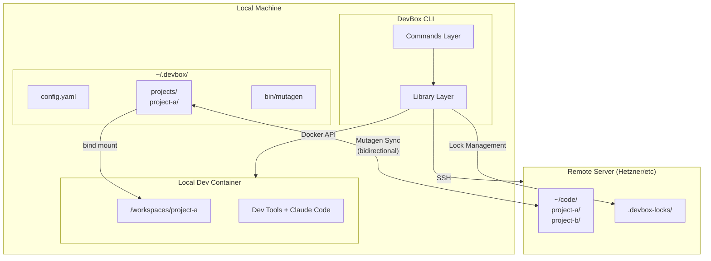
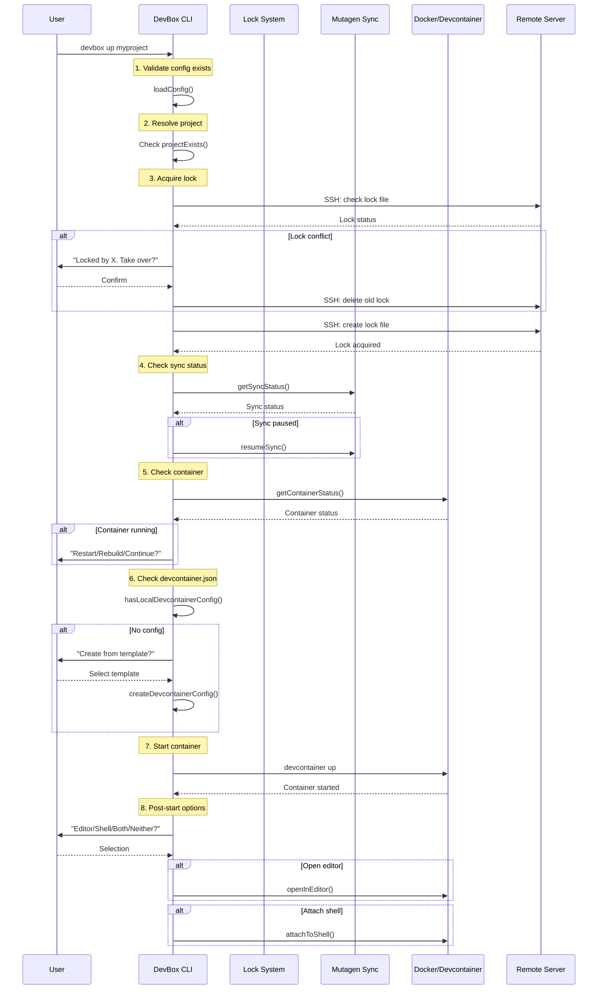

# Architecture Overview

This section describes the internal architecture and design decisions of DevBox.

## High-Level Architecture

DevBox is a local-first development environment tool that syncs code between local machines and a remote server, running containers locally for zero-latency development.



## Core Components

### Command Layer (`src/commands/`)

Handles user input and orchestrates operations. Each command is a separate module:

| Command | Purpose |
|---------|---------|
| `init` | Interactive setup wizard |
| `clone` | Copy project from remote to local |
| `push` | Push local project to remote |
| `up` | Start container, acquire lock |
| `down` | Stop container, keep lock |
| `status` | Show project status |
| `browse` | List remote projects |
| `list` | List local projects |
| `editor` | Change default editor |
| `rm` | Remove local project |
| `new` | Create new project on remote |
| `config` | View/edit configuration |
| `config-devcontainer` | Manage devcontainer.json from remote templates |
| `remote` | Manage multiple remotes |
| `shell` | Enter container shell |
| `logs` | View container and sync logs |
| `update` | Update Mutagen binary |
| `open` | Open project in editor |
| `doctor` | Diagnose environment issues |

### Library Layer (`src/lib/`)

Shared functionality used by commands:

| Module | Responsibility |
|--------|----------------|
| `config.ts` | Read/write `~/.devbox/config.yaml` |
| `container.ts` | Docker/devcontainer operations |
| `mutagen.ts` | Sync session management |
| `ssh.ts` | SSH connection testing, key setup |
| `lock.ts` | Multi-computer lock management |
| `project.ts` | Project path resolution |
| `download.ts` | Mutagen binary download |
| `templates.ts` | Devcontainer templates |
| `paths.ts` | Path constants |
| `errors.ts` | Error handling utilities |
| `ui.ts` | Terminal output (spinners, colors) |
| `shell.ts` | Shell escaping utilities |
| `constants.ts` | Shared constants (Docker labels, etc.) |
| `remote.ts` | Remote project operations |
| `migration.ts` | Config format migration |
| `startup.ts` | Dependency checks at launch |
| `encryption.ts` | AES-256-GCM encryption for secrets |
| `validation.ts` | Input validation and path safety |
| `projectTemplates.ts` | Built-in + user-defined project templates |

### Type Definitions (`src/types/`)

Centralized TypeScript interfaces for:
- Configuration (`DevboxConfig`, `ProjectConfig`)
- Container status (`ContainerStatus`, `ContainerInfo`)
- Sync status (`SyncStatus`)
- Lock management (`LockInfo`, `LockStatus`)
- Command options (`UpOptions`, `DownOptions`)

## Data Flow: `devbox up`

Here is the complete flow when a user runs `devbox up myproject`:



## File System Layout

```
~/.devbox/
├── config.yaml          # Main configuration
├── bin/
│   └── mutagen          # Bundled sync binary
├── projects/
│   ├── project-a/       # Synced project copy
│   │   ├── .git/        # Full git history (synced)
│   │   ├── .devcontainer/
│   │   └── src/
│   └── project-b/
└── logs/                # Log files

~/code/ (on remote)
├── project-a/           # Canonical source
├── project-b/
└── .devbox-locks/       # Lock files
    └── project-a.lock
```

## External Dependencies

| Tool | Purpose | How Used |
|------|---------|----------|
| Docker | Container runtime | Required for devcontainers |
| devcontainer CLI | Container lifecycle | Bundled via npm |
| Mutagen | File sync | Auto-downloaded to `~/.devbox/bin/` |
| SSH | Remote access | System SSH client |

## Key Libraries

| Package | Purpose |
|---------|---------|
| commander | CLI argument parsing |
| inquirer | Interactive prompts |
| chalk | Colored output |
| ora | Spinners |
| execa | Running external commands |
| yaml | Config file parsing |
